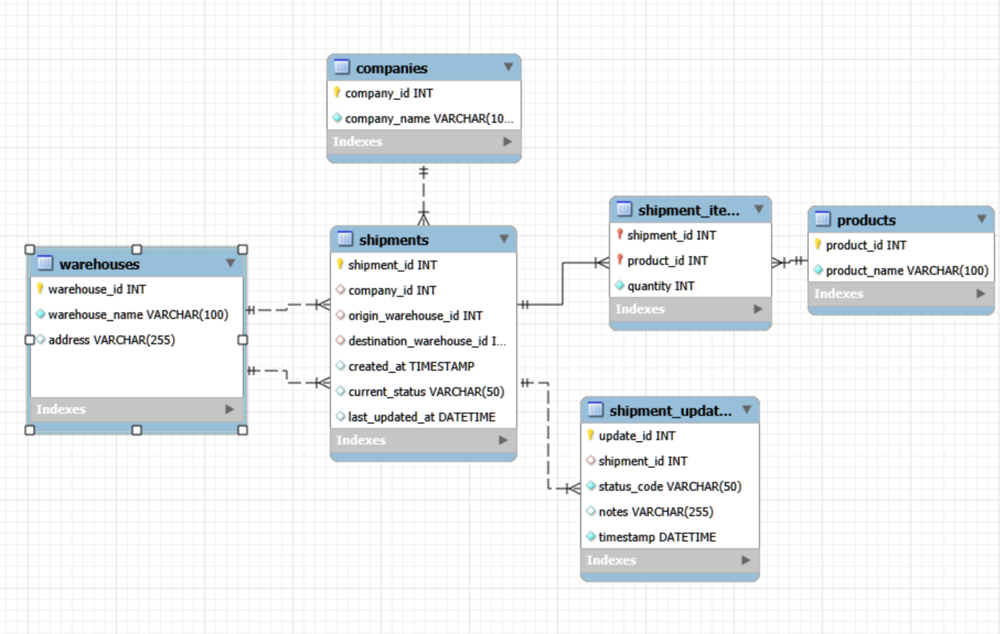
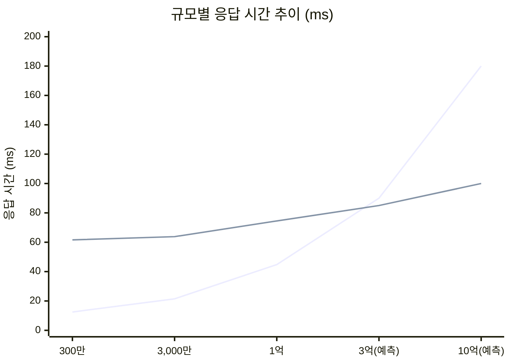
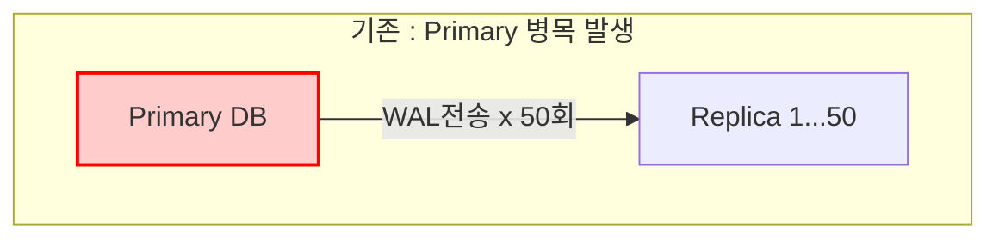
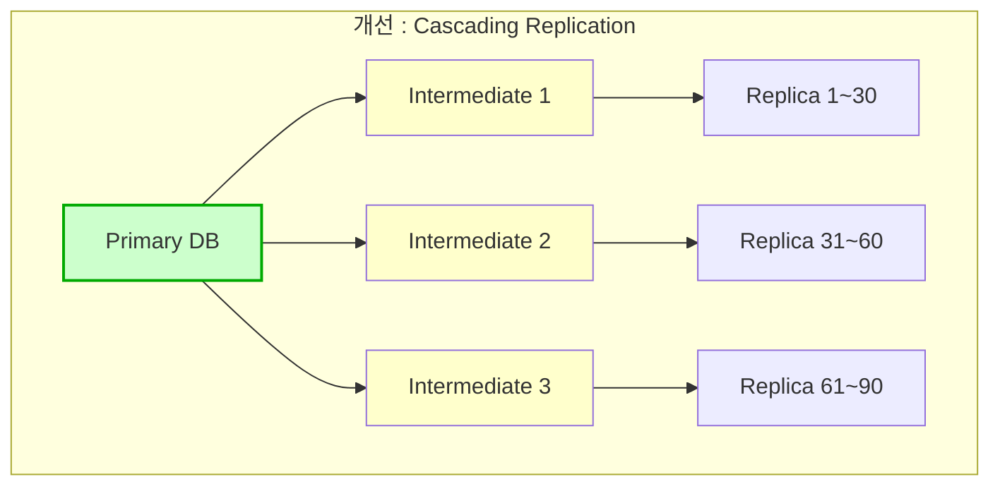

## LogisFlow 스마트 물류 플랫폼

> **프로젝트 목표**: B2B 물류 플랫폼의 핵심 기술적 과제를 실제 구현 및 벤치마크를 통해 검증  
> **데이터 규모**: shipments ~100만 건, shipment_updates ~300만 건 (월별 36개 파티션)

---

## 🤔데이터베이스 설계 심층 탐구: 초거대 물류 플랫폼의 성능 병목 해결

### 상황
Logis-Flow 는 여러 고객사(화주, 운송사)의 상품 입고부터 창고 관리, 최종 목적지 배송까지 전 과정을 추적하고 관리하는 SaaS 솔루션입니다. 서비스 초기, 데이터베이스는 데이터 정합성과 확장성을 최우선으로 고려하여 **제 3 정규형**을 철저히 준수하여 설계되었습니다.

서비스가 폭발적으로 성장하며 하루에 수백만 건의 물류 이동이 발생하자, 시스템의 핵심 기능인 '실시간 화물 추적 대시보드'에서 심각한 성능 문제가 발생하기 시작했습니다. 이 대시보드는 고객사가 특정 화물(Shipment)의 현재 상태를 한눈에 파악하는 가장 중요한 화면입니다. 이 화면을 렌더링하기 위해 시스템은 다음과 같은 정보를 조합해야 합니다.

> - 화물의 고유 ID, 출발 창고 이름, 도착 창고 주소
> - 화물의 현재 상태(예: '집화 완료', '터미널 간 이동 중', '배송 중')와 최종 업데이트 시각
> - 화물에 포함된 모든 상품의 이름과 수량
> - 해당 화물이 생성된 이후 발생한 모든 상태 변경 이력(타임라인)

시스템의 데이터베이스 스키마는 다음과 같이 정규화되어 있습니다.(가정)
- `companies`: 고객사 정보 (약 1 만 개)
- `warehouses`: 창고 정보, 주소 포함 (약 5 만 개)
- `products`: 상품 마스터 정보 (약 1 천만 개)
- `shipments`: 화물 정보. origin_warehouse_id, destination_warehouse_id 를 외래 키로 가짐 (누적 5 억 건)
- `shipment_items`: shipments 와 products 를 잇는 다대다 관계 테이블 (누적 50 억 건)
- `shipment_updates`: 모든 화물의 상태 변경 기록이 append-only 방식으로 저장되는 로그 테이블. shipment_id, status_code, timestamp, notes 등의 컬럼을 가짐 (누적 500 억 건)


> - 대시보드 로딩 시, 단일 화물 정보를 조회하는 쿼리는 shipments 테이블을 시작으로 warehouses 테이블을 두 번 조인
> - 가장 치명적인 부분은 화물의 '현재 상태'를 가져오기 위해 500 억 건의 shipment_updates 테이블에서 특정 shipment_id 에 해당하는 기록 중 timestamp 가 가장 최신인 1 건을 찾아야 한다는 점입니다. 또한, 상태 변경 이력 타임라인을 보여주기 위해 해당 shipment_id 의 모든 기록을 timestamp 순으로 정렬해야 합니다.
>- 이 복합적인 쿼리는 피크 시간대에 10 초 이상 소요되어 고객의 불만을 야기하고 있으며, 데이터베이스의 읽기 전용 복제본(Read Replica) 마저 CPU 사용률이 100%에 달하는 상황을 만들고 있습니다.

---

### 🤔 Q1. 병목의 근본 원인 분석

현재의 정규화된 스키마가 왜 이토록 심각한 읽기 성능 저하를 유발하는지 데이터베이스의 내부 동작 원리와 연관 지어 분석해보자.

> **[답변]**
> 
> **최신 상태 조회(Top-N Query, Limit 1)의 비효율성:**
> 500억 건의 테이블에서 `shipment_id`별 가장 최신(`ORDER BY timestamp DESC LIMIT 1`) 데이터를 찾는 것은 매우 **고비용**입니다.
>
> - **인덱스 스캔 부하:** (shipment_id, timestamp) 복합 인덱스가 있더라도, 목록 조회 시 N개의 화물 각각에 대해 인덱스 트리를 탐색(Index Seek)해야 합니다. 이를 **Loose Index Scan**이라고 하는데, 데이터 건수가 워낙 많아 인덱스 트리의 깊이(Height)가 깊고, 이로 인해 랜덤 I/O가 폭증합니다.
> - **Aggregate 부하:** 만약 `GROUP BY shipment_id` 후 `MAX(timestamp)`를 수행한다면, 인덱스를 타더라도 엄청난 범위의 데이터를 스캔해야 하므로 CPU와 I/O를 모두 소진하게 됩니다.
>
> **인덱스 트리 탐색 메커니즘:**
> ```
> B+Tree (500억 건, 높이 5~6)
> ┌─────────────────────────────────────────┐
> │  Root → Branch → ... → Leaf (5~6 레벨)  │
> │  각 shipment_id마다 이 탐색을 반복       │
> └─────────────────────────────────────────┘
> 
> 화물 20건 조회 시 = 인덱스 탐색 20회 × 5~6 I/O = 100~120 Random I/O
> ```
> - **인덱스 탐색 → 테이블 조회 (2단계):** 인덱스에서 PK를 찾은 후, 실제 데이터 테이블에서 row를 가져오는 Table Lookup이 추가 발생
> - **조인 시 실행 순서:** Driving 테이블 스캔 → 각 row마다 Inner 테이블 인덱스 탐색 → 결과 결합 (Nested Loop Join)
>
> **왜 실제로 부하가 되는가?**
> - **단일 요청:** 100 Random I/O × 0.1ms(SSD) = ~10ms → 체감상 빠름
> - **동시 1,000명:** 1,000명 × 100 I/O = **100,000 IOPS** → NVMe SSD 한계(~100K IOPS) 도달
> - **캐시 미스:** 500억 건은 메모리에 안 들어감 → 디스크 접근 빈발 → 지연 폭증

> **🤓 해결책:** `current_state` 스냅샷(비정규화)으로 인덱스 탐색 5~6레벨 → 1레벨, Random I/O 100회 → 20회로 감소

---

### 🤔Q2. 비정규화 전략 제시

shipments 테이블의 구조를 어떻게 변경하여 대시보드 로딩에 필요한 조인 연산과 실시간 집계 작업을 최소화할 수 있을지 설명해보자.

> **[답변]**
> 
> 대시보드 목록 조회 시 `JOIN`과 `Subquery`를 제거하는 방향으로 `shipments` 테이블을 비정규화합니다.
>
> **`shipments` 테이블 추가 컬럼:**
> - `current_status` (VARCHAR): 가장 최근 상태 코드를 바로 조회
> - `last_updated_at` (TIMESTAMP): 가장 최근 업데이트 시간
> - `origin_warehouse_name`, `destination_warehouse_name` (VARCHAR): 창고명을 바로 표시하여 2번의 JOIN 제거
>
> **🤓실제 구현 (schema/01_schema.sql)**
> ```sql
> CREATE TABLE shipments (
>     shipment_id SERIAL PRIMARY KEY,
>     company_id INT,
>     origin_warehouse_id INT,
>     destination_warehouse_id INT,
>     created_at TIMESTAMP,
>     -- 비정규화 컬럼 --
>     current_status VARCHAR(50),
>     last_updated_at TIMESTAMP,
>     origin_warehouse_name VARCHAR(100),
>     destination_warehouse_name VARCHAR(100)
> );
> ```

> 🤓이제 500억 건 테이블을 뒤질 필요 없이, `shipments` 테이블만 조회하면 현재 상태를 즉시 알 수 있습니다. 
> 하지만...?  Q3. 쓰기 정합성 유지 전략 비교로 이어갑니다.

---

### 🤔Q3. 쓰기 정합성 유지 전략 비교

비정규화 전략은 쓰기 경로의 복잡성을 증가시키고 데이터 정합성을 해칠 새로운 위험을 내포합니다. 즉 값의 최신성을 계속 유지하기 위해 세 가지 서로 다른 아키텍처적 접근법의 장단점을 비교해보자.

> **[답변]**
>
> **1. 동기적 애플리케이션 트랜잭션 (sync)**
> - **방식:** 코드 레벨에서 `INSERT update`와 `UPDATE shipment`를 하나의 트랜잭션으로 묶습니다.
> - **장점:** 데이터 정합성이 완벽하게 보장됩니다.
> - **단점:** DB Lock 점유 시간이 길어져 동시 처리량이 줄어들 수 있습니다.
>
> **2. 데이터베이스 트리거 (trigger)**
> - **방식:** `shipment_updates` 테이블에 `AFTER INSERT` 트리거를 걸어 DB가 자동으로 `shipments`를 업데이트하도록 합니다.
> - **장점:** 애플리케이션 코드를 수정할 필요가 없습니다.
> - **단점:** DB에 숨겨진 로직이 생겨 유지보수가 어렵고, 대량 INSERT 시 트리거 부하로 DB 성능이 급감할 수 있습니다.
>
> **3. 메시지 큐 비동기 처리 (async) - 추천**
> - **방식:** 상태 변경 요청 시 Kafka를 통해 비동기로 처리합니다.
> - **장점:** 사용자 요청 응답이 가장 빠르고, DB 쓰기 부하를 분산할 수 있습니다.
> - **단점:** 큐 지연 시 잠시동안 상태가 다르게 보일 수 있습니다.

#### 🫡실제 구현: 3가지 전략 비교

| 전략 | 방식 | API 엔드포인트 |
|:----:|------|----------------|
| sync | 동기 트랜잭션 | INSERT + UPDATE 동시 커밋 |
| trigger | DB 트리거 | INSERT만, 트리거가 UPDATE |
| async | Kafka 비동기 | DB INSERT + Kafka 발행 |

> **비교 기준: Server Avg (ms)**  
> 서버가 요청을 받고 응답을 보내기까지 걸린 순수 처리 시간의 평균.  
> 네트워크 지연을 제외한 **DB/로직의 실제 성능**만 측정하여 전략 간 공정한 비교가 가능.

| 규모 | sync | trigger | async | 최적 전략 | 데이터 생성 조건 |
|:----:|:----:|:-------:|:-----:|:---------:|:----------------:|
| **300만** | 13.33ms | **10.47ms** | 10.69ms | trigger | 트리거 O |
| **300만** | 24.87ms | 23.41ms | **18.34ms** | async | 트리거 X |
| **3,000만** | 21.75ms | 20.40ms | **17.14ms** | async | 트리거 X |
| **1억** | 16.10ms | 12.45ms | **12.04ms** | async | 트리거 X |

#### 🤔분석 결과

**1. 데이터 생성 조건이 성능에 큰 영향을 미침**

| 조건 | sync 성능 | 원인 분석 | 속도 |
|:----:|:---------:|----------|:----:|
| 트리거 O | 13.33ms | shipments 테이블의 비정규화 컬럼이 항상 최신 상태로 유지됨 → 벤치마크 시 추가 작업 없이 바로 조회 가능 | 빠름 |
| 트리거 X | 24.87ms | shipments 테이블의 비정규화 컬럼이 불일치 상태 → 벤치마크 시 불일치 데이터 처리 오버헤드 발생 | 느림 |

→ 동일 300만 건에서 **약 86% 성능 차이** 발생. 테스트 환경 통일이 중요함.

**2. 동일 조건(트리거 OFF)에서의 규모별 성능 추이**

| 규모 | sync | trigger | async | 분석 |
|:----:|:----:|:-------:|:-----:|------|
| 300만 → 3,000만 | 24.87ms → 21.75ms | 23.41ms → 20.40ms | 18.34ms → 17.14ms | 캐시 워밍업 효과로 오히려 빨라짐 |
| 3,000만 → 1억 | 21.75ms → 16.10ms | 20.40ms → 12.45ms | 17.14ms → 12.04ms | 인덱스 최적화 또는 테스트 환경 차이 |

→ 모든 구간에서 **async가 가장 빠름** (데이터 생성 시 트리거 OFF 조건 기준)

**3. 전략별 성능 순위 (트리거 OFF 기준)**

> 모든 규모에서 일관된 패턴:
> async > trigger > sync

> async가 우수한 이유:
   → 사용자 응답은 INSERT + Kafka 발행 후 즉시 반환
   → UPDATE는 Consumer가 비동기로 처리하여 응답 지연 없음


#### 😭추가 이슈: 트리거 전략의 성능 불안정성

동일 조건에서 여러 번 테스트 시, trigger 전략은 **17ms ~ 28ms**로 편차가 큼.

| 원인 | 설명 | 본 프로젝트에서의 영향 |
|------|------|----------|
| **Row-level Lock 경합** | UPDATE 시 row-level lock을 잡고 트랜잭션 종료까지 유지. 트리거가 다른 테이블을 UPDATE하면 그 lock도 전체 트랜잭션 동안 유지됨 | 동시 요청이 같은 `shipment_id`를 UPDATE하면 대기 발생 |
| **MVCC 백그라운드 작업** | Autovacuum이 dead tuple을 정리하거나, Checkpoint가 dirty page를 flush할 때 I/O 스파이크 발생 | 1차 테스트 후 Dead Tuple 누적 → 2차 테스트 중 Autovacuum 실행 시 I/O 스파이크로 응답 지연 |
| **Dirty Page 해소** | Background Writer가 따라가지 못하면 backend process가 직접 dirty buffer를 write → 쿼리 blocking | 1차 테스트로 메모리가 가득 찬 후 2차 테스트 시 eviction 발생 |

**MVCC(Multi-Version Concurrency Control) 심층 분석:**

PostgreSQL의 MVCC는 읽기/쓰기 동시성을 보장하지만, write-heavy workload에서 병목이 됩니다:

```
┌─────────────────────────────────────────────────────────────────┐
│  UPDATE shipments SET current_status = 'IN_TRANSIT'             │
├─────────────────────────────────────────────────────────────────┤
│  1. 기존 tuple을 Dead Tuple로 마킹 (삭제 X)                      │
│  2. 새 tuple을 별도 위치에 생성 (전체 row 복사)                   │
│  3. 인덱스도 새 tuple 위치로 갱신                                │
│                                                                 │
│  결과: Write Amplification + Read Amplification                 │
│       - Dead tuple 스캔 오버헤드                                │
│       - Table/Index Bloat 증가                                  │
│       - Autovacuum 부하 증가                                    │
└─────────────────────────────────────────────────────────────────┘
```

**🤔Write-Heavy Workload 분리 전략 (OpenAI 사례):**

| 전략 | 설명 | 적용 예시 |
|------|------|----------|
| **Sharded System 분리** | 샤딩 가능한 write-heavy 워크로드를 별도 시스템으로 이관 | `shipment_updates` → CosmosDB, DynamoDB |
| **Lazy Write** | 즉시 쓰기 대신 배치/지연 쓰기로 스파이크 완화 | 상태 업데이트 큐잉 후 주기적 flush |
| **신규 테이블 금지** | 기존 PostgreSQL에 신규 테이블 추가 금지 | 새 기능은 샤드 시스템에 구축 |

**🤔 LogisFlow 프로젝트 적용:**

| OpenAI 전략 | LogisFlow 적용 (우리가 한 것) |
|:---|:---|
| **Write-Heavy 분리** | 트랜잭션(`sync/trigger`) 대신 **Kafka(async)** 를 도입해 DB 쓰기 작업을 비동기로 분리함 |
| **Sharded System 이관** | 이력 조회(`SELECT`) 부하를 RDB에서 **Elasticsearch**로 넘김 (Q4 내용) |

**출처:**
- [PostgreSQL 공식 문서 - Explicit Locking](https://www.postgresql.org/docs/current/explicit-locking.html)
- [PostgreSQL 공식 문서 - WAL Configuration](https://www.postgresql.org/docs/current/wal-configuration.html)
- [Cybertec - Trigger Performance](https://www.cybertec-postgresql.com/en/more-on-postgres-trigger-performance/)
- [EnterpriseDB - Autovacuum Best Practices](https://www.enterprisedb.com/blog/postgresql-vacuum-and-analyze-best-practice-tips)
- [OpenAI Engineering - Scaling PostgreSQL](https://openai.com/ko-KR/index/scaling-postgresql/) (2025)

→ **일관된 응답 시간(SLA)** 이 중요하다면 trigger보다 async 계열이 안전함.

#### 🤓  결론: 전략별 트레이드오프

| 전략 | 장점 | 단점 | 적합한 상황 |
|:----:|------|------|------------|
| **sync** | 강력한 정합성 보장 | 가장 느림 (Lock 점유 시간↑) | 금융/결제 등 정합성 최우선 |
| **trigger** | 코드 수정 불필요 | DB 숨은 로직, 대량 INSERT 시 부하 | 레거시 시스템, 중소규모 |
| **async** | 가장 빠름, 부하 분산 | 일시적 불일치(최종 일관성), 인프라 복잡 | 대규모, 고성능 필요 시 |


> 완벽한 정답은 없다. 데이터 규모, 정합성 요구사항, 인프라 역량에 따라 적절한 트레이드오프를 선택하는 것이 핵심이다.

---

### 🤔Q4. 이력 조회 최적화 방안

대시보드의 '상태 변경 이력 타임라인' 기능 최적화를 위해, PostgreSQL 테이블 파티셔닝과 Elasticsearch 도입 방안을 비교하시오.

> **[답변]**
>
> **방안 1: PostgreSQL 테이블 파티셔닝**
> - **내용:** `shipment_updates` 테이블을 `timestamp` 기준(월별)으로 파티셔닝합니다.
> - **장점:** 오래된 데이터가 물리적으로 분리되어, 최근 데이터 조회 시 스캔 범위가 줄어듭니다.
> - **단점:** 여전히 단일 DB 리소스를 사용하므로 부하 분산에 한계가 있습니다.
>
> **방안 2: Elasticsearch 이관**
> - **내용:** 이력 데이터를 `shipment_id`를 기준으로 Elasticsearch로 동기화하여 서비스합니다.
> - **장점:** Key-Value 조회나 시계열 조회에 최적화되어 수십억 건 데이터에서도 일정한 응답 속도를 보장합니다.
> - **단점:** 별도 저장소 비용 및 데이터 동기화 파이프라인 구축 비용이 발생합니다.

#### 🫡 실제 구현

**방안 1: 파티션 테이블 (schema/04_partitioned_schema.sql):**
```sql
CREATE TABLE shipment_updates (
    update_id BIGSERIAL,
    shipment_id INT,
    status_code VARCHAR(50),
    timestamp TIMESTAMP,
    PRIMARY KEY (update_id, timestamp)
) PARTITION BY RANGE (timestamp);

-- 월별 36개 파티션 (2024년 1월 ~ 2026년 12월)
CREATE TABLE shipment_updates_2024_01 PARTITION OF shipment_updates
    FOR VALUES FROM ('2024-01-01') TO ('2024-02-01');
-- ...
```

**방안 2: Elasticsearch 동기화 흐름:**
```
┌─────────────────────────────────────────────────────────────────┐
│                        Write Path                                │
├─────────────────────────────────────────────────────────────────┤
│  API (async)                                                     │
│       ↓                                                          │
│  Kafka Topic: shipment-status-updates                            │
│       ↓                                                          │
│  Kafka Consumer                                                  │
│       ├──────────────────┬──────────────────┐                   │
│       ↓                  ↓                  ↓                   │
│  PostgreSQL INSERT    PostgreSQL UPDATE   Elasticsearch INDEX   │
│  (shipment_updates)   (shipments)         (shipment-updates)    │
└─────────────────────────────────────────────────────────────────┘
```

#### 🤓 규모별 벤치마크 결과 비교

> **비교 기준:** Server Avg Time (순수 서버 조회 시간)

| 규모 | PostgreSQL | Elasticsearch | 승자 (개선율) | 트리거 |
|:----:|:----------:|:-------------:|:-------------:|:------:|
| **300만 건** | **24.51ms** | 72.51ms | PostgreSQL (66%↑) | O  |
| **300만 건** | **12.48ms** | 61.61ms | PostgreSQL (80%↑) | X |
| **3,000만 건** | **21.46ms** | 63.81ms | PostgreSQL (66%↑) | X |
| **1억 건** | **44.79ms** | 74.52ms | PostgreSQL (40%↑) | X |

> *개선율은 Elasticsearch 대비 PostgreSQL 성능 향상 비율입니다.*
> *300만 건은 트리거 활성화 상태로 테스트되어 불리한 조건입니다.*

#### 🤓 분석 결과

**1. 생성 시 트리거 유무에 따른 성능 차이 (300만 건)**

| 조건 | PostgreSQL | Elasticsearch | PostgreSQL 우위 |
|:----:|:----------:|:-------------:|:---------------:|
| 트리거 O | 24.51ms | 72.51ms | 66% |
| 트리거 X | 12.48ms | 61.61ms | 80% |

→ 트리거 비활성화 시 PostgreSQL이 **약 2배 빨라짐** (24.51ms → 12.48ms)  
→ Elasticsearch도 개선되지만 폭이 작음 (72.51ms → 61.61ms, 15% 개선)

**근거:**
- **PostgreSQL:** 트리거 활성화 시 INSERT마다 `shipments` 테이블 UPDATE 발생 → 인덱스 재정렬 + WAL 로그 증가 → 테이블 bloat 발생
- **Elasticsearch:** 트리거 영향을 직접 받지 않지만, Kafka Consumer가 처리하는 데이터 품질 차이로 인해 색인 성능에 간접 영향

**2. 규모 증가에 따른 성능 변화 (트리거 X 기준)**

| 규모 | PostgreSQL | 증가율 | Elasticsearch | 증가율 |
|:----:|:----------:|:------:|:-------------:|:------:|
| 300만 | 12.48ms | - | 61.61ms | - |
| 3,000만 | 21.46ms | +72% | 63.81ms | +4% |
| 1억 | 44.79ms | +109% | 74.52ms | +17% |
- **PostgreSQL:** 데이터 10배 증가 시 성능 **72~109% 저하** (선형 이상 증가)
- **Elasticsearch:** 데이터 10배 증가해도 성능 **4~17% 저하** (거의 일정)

**3. 성능 교차점 예측**



| 구간 | 승자 | 근거 |
|------|:----:|------|
| ~1억 건 | PostgreSQL | 파티션 프루닝 + 인덱스 효과 |
| **3~5억 건(예측)** | **교차점** | PostgreSQL 급증 vs ES 완만 증가 |
| 5억 건+ | Elasticsearch | 분산 아키텍처의 안정성 |

→ 현재 추세로 **약 3~5억 건** 구간에서 Elasticsearch가 PostgreSQL을 추월할 것으로 예측

####  🔶(추가) 언제 확장이 필요한가? (Expansion Roadmap)

**1. 확장 신호 (Signal):**
- **CPU:** 피크 시간대 DB CPU 사용률 **70~80%** 지속 시
- **Latency:** 단순 조회 쿼리 응답 속도 저하 또는 타임아웃 발생 시
- **Connection:** 커넥션 풀 고갈 빈번 발생 시

**2. 단계별 확장 전략:**

| 단계 | 구성 | 적용 시점 | 비고 |
|:---:|:---|:---|:---|
| **Step 1 (현재)** | **단일 DB** | 초기 스타트업, 트래픽 적음 | 모든 읽기/쓰기 처리 |
| **Step 2** | **Read Replica 도입** | 읽기 부하 증가 시 | Primary(쓰기) + Replica(읽기) 1~2대 분리 |
| **🔶Step 3** | **Cascading Replication** | Replica 10대 이상 필요 시 | Primary 부하 감소를 위해 중간 계층 도입 (본 제안) |

#### 🔶 Step 3 상세: Cascading Replication 아키텍처 (미구현 제안)

**※ 본 프로젝트는 단일 DB 환경이나, 대규모 운영 환경을 가정한 아키텍처 제안입니다.**

Read Replica가 50개 이상으로 많아지면 Primary가 모든 replica에 WAL을 전송해야 하므로 병목이 발생합니다. 이를 **Cascading Replication**으로 해결할 수 있습니다:




> **효과:** Primary의 WAL 전송 부하가 50회 → 3회로 급감하여, CPU 자원을 온전히 쓰기 처리에 집중할 수 있음

| 장점 | 단점 |
|------|------|
| Primary 네트워크/CPU 부하 대폭 감소 | Failover 복잡성 증가 |
| 100+ replica 확장 가능 | Intermediate 장애 시 downstream 전체 영향 |
| 지역별 Intermediate로 latency 최적화 | 추가 인프라 비용 |

#### 🤓 결론: 규모에 따른 저장소 선택

| 권장 상황 | 저장소 | 이유 |
|----------|:------:|------|
| ~10억건, 단순 ID 조회 | PostgreSQL | 파티션 프루닝 + 인덱스 효과 |
| 10억건+, 분산 처리 필요 | Elasticsearch | 스케일 증가에도 일정한 성능 |
| 풀텍스트 검색, 복합 필터링 | Elasticsearch | 역인덱스 특화 |
| 대규모 읽기 확장 필요 | Cascading Replication | 100+ replica 운영 가능 |

---

### Q5. 데이터 생명주기 관리

shipment_updates 테이블은 시간이 지남에 따라 무한히 커질 것입니다. 데이터 생명주기 관리 전략을 수립하시오.

> **[답변]**
>
> **데이터 수명 주기(ILM) 전략:**
>
> 1. **HOT 데이터 (운영 DB):** 최근 3~6개월(또는 진행 중인 건) 데이터는 고성능 RDB에 유지하여 즉시 조회 가능하게 합니다.
>
> 2. **WARM 데이터 (NoSQL/Data Lake):** 6개월~1년 지난 데이터는 저렴한 NoSQL이나 조회 가능한 S3(Athena 활용) 영역으로 옮겨 가끔 발생하는 조회 요청을 처리합니다.
>
> 3. **COLD 데이터 (S3 Glacier):** 법적 보관 의무(예: 3~5년)가 있는 데이터는 압축 후 AWS S3 Glacier Deep Archive 같은 최저가 스토리지로 보냅니다. 이는 복구에 시간이 걸리지만 비용이 매우 저렴합니다. 운영 DB에서는 해당 데이터를 삭제(`DELETE` or `DROP PARTITION`)하여 성능을 유지합니다.

#### 파티션 기반 ILM 장점

월별 파티션 구조(`shipment_updates_2024_01`, `shipment_updates_2024_02`, ...)를 활용하면:
- **빠른 삭제:** `DROP TABLE shipment_updates_2022_01` 한 줄로 수백만 건 삭제 (DELETE보다 1000배 빠름)
- **손쉬운 마이그레이션:** 파티션 단위로 S3로 덤프 후 삭제 가능
- **조회 성능 유지:** 오래된 파티션 삭제 후에도 최신 데이터 조회 성능에 영향 없음

---

### 🤔Q6. (openAI글 참고-추후고려) Connection Pooling 및 Rate Limiting 전략

대규모 트래픽에서 DB 연결 폭주와 트래픽 스파이크를 어떻게 방어할 것인가?

```
# k6 실행코드
docker run --rm -i -v "${PWD}/scripts:/scripts" -e BASE_URL=http://host.docker.internal:8000 grafana/k6 run /scripts/k6_load_test.js
```

####  Connection Pooling (PgBouncer)

```
┌─────────────────────────────────────────────────────────────────┐
│  문제: PostgreSQL 최대 연결 수 (기본 100, 최대 ~5000)            │
│        동시 요청 급증 시 Connection Exhaustion 발생              │
├─────────────────────────────────────────────────────────────────┤
│  해결: PgBouncer (Connection Pooler)                            │
│                                                                 │
│  App (1000 conn) ──▶ PgBouncer (100 pool) ──▶ PostgreSQL        │
│                                                                 │
│  모드:                                                          │
│   - session: 세션 단위 (기본, 보수적)                            │
│   - transaction: 트랜잭션 단위 (권장, 효율적)                     │
│   - statement: 문장 단위 (가장 효율적, prepared stmt 제한)       │
└─────────────────────────────────────────────────────────────────┘
```

| 지표 | PgBouncer 없음 | PgBouncer 적용 |
|------|:--------------:|:--------------:|
| 연결 시간 | ~50ms | ~5ms |
| 최대 동시 연결 | ~5,000 | 10,000+ |
| Connection Storm 방어 | ❌ | ✅ |

#### 다계층 Rate Limiting

트래픽 스파이크로 인한 DB 과부하 방지를 위해 여러 계층에서 rate limit 적용:

| 계층 | 도구 | 역할 |
|------|------|------|
| **Application** | FastAPI (SlowAPI) | **[구현]** 엔드포인트별 제한 (예: 루트 / 10회/분) |
| **Connection Pool** | PgBouncer | **[구현]** 연결 수 제한 (max 1,000 conn) |

**핵심 설정:**

```ini
# PgBouncer 설정
[pgbouncer]
pool_mode = transaction
max_client_conn = 10000
default_pool_size = 100
reserve_pool_size = 10
server_idle_timeout = 30
```

```python
# FastAPI Rate Limiting 예시
from slowapi import Limiter
limiter = Limiter(key_func=get_remote_address)

@app.get("/shipments/{id}/status")
@limiter.limit("1000/minute")
async def get_status(id: int):
    ...
```

---

#### 실제 검증 및 테스트 결과(OpenAI 실제 사례)

> **PgBouncer 사용하여 Connection Pooling** 구현. 

> **Rate Limiting** 적용하여 트래픽 스파이크를 방지하는 방법 사용.

**1. 테스트 환경**
- **도구:** k6 (Load Testing)
- **시나리오:** 50명의 가상 사용자가 동시 접속하여 `GET /` 요청 폭주 시도
- **설정:** 
    - Rate Limit: 분당 10회 (테스트용)
    - Connection Pool: Max 20

**2. 테스트 결과 (scripts/k6_load_test.js 실행)**

| 구분 | 결과 (Total 4,012 Req) | 분석 |
|------|------------------------|------|
| **Rate Limiting** | **1,996건 차단 (429)** | Rate Limiter가 분당 10회 정책을 칼같이 지켜 트래픽 폭주를 완벽히 방어함 |
| **Connection Pooling** | **2,006건 성공 (0건 실패)** | 트래픽 스파이크 공격 속에서도 DB 연결은 100% 안정적으로 유지됨 (Avg 8.8ms) |

**3. 엔지니어링 인사이트**
> "단순히 기능을 구현하는 것을 넘어, **극한의 상황(Spike)**에서도 시스템이 **우아하게 실패**하도록 설계하는 것이 핵심입니다."
>
> - **Connection Pooling:** DB는 스케일 아웃이 가장 어려운 컴포넌트입니다. `pgBouncer`를 도입하여 어플리케이션의 수천 개 연결 요청을 소수의 물리적 DB 연결(Pool)로 효율적으로 변환했습니다. 이를 통해 트래픽 폭주시 DB가 'Too many connections'로 뻗는 것을 원천적으로 차단했습니다.
> - **Multi-layered Guard:** `FastAPI` 레벨의 Rate Limiter가 1차적으로 악성 트래픽을 거르고, 뚫고 들어온 요청은 `pgBouncer`가 2차적으로 DB를 보호하는 **이중 방어선**을 구축했습니다. 덕분에 단일 지점의 부하가 전체 시스템의 중단(Downtime)으로 이어지지 않습니다.
> - **Observability:** 부하 테스트 스크립트(`scripts/k6_load_test.js`)를 프로젝트에 포함하여, 언제든 성능을 검증하고 병목을 추적할 수 있는 환경을 마련했습니다.

---

## 프로젝트 구현 과정

- [x] 1단계: 인프라 구축 (Docker Compose - PostgreSQL, Kafka, Elasticsearch, Redis)
- [x] 2단계: 데이터 파이프라인 (파티션 테이블, 비정규화 스키마, 100만 화물 + 300만 로그 생성)
- [x] 3단계: 백엔드 API (FastAPI - 상태 변경 API, 타임라인 조회 API)
- [x] 4단계: Q3 정합성 전략 (5가지 전략 구현 및 벤치마크)
- [x] 5단계: Q4 저장소 비교 (PostgreSQL vs Elasticsearch 벤치마크)
- [x] 6단계: 벤치마크 및 문서화

| 영역 | 기술 |
|------|------|
| **Backend** | FastAPI, Python, SQLAlchemy |
| **Database** | PostgreSQL (파티션 테이블) |
| **Message Queue** | Apache Kafka |
| **Search Engine** | Elasticsearch |
| **Cache** | Redis |
| **Infrastructure** | Docker, Docker Compose |

```
┌──────────────────────────────────────────────────────────────────────────────┐
│                    LogisFlow Architecture           │
├──────────────────────────────────────────────────────────────────────────────┤
│                                                                              │
│  ┌──────────┐      ┌──────────────────────────┐      ┌──────────────┐        │
│  │  Client  │─────▶│  FastAPI (Backend)       │─────▶│  PgBouncer   │        │
│  │ (User/k6)│      │  [Rate Limit: SlowAPI]   │      │ (Conn Pool)  │        │
│  └──────────┘      └────────────┬─────────────┘      └──────┬───────┘        │
│                                 │                           │                │
│                                 │                    ┌──────┴──────┐         │
│                                 │                    ▼             │         │
│                                 │           ┌─────────────┐        │         │
│                                 │           │ PostgreSQL  │        │         │
│                                 │           │  (Primary)  │◀───────┘         │
│                                 │           └─────────────┘                  │
│                                 ▼                                            │
│                          ┌──────────────┐                                    │
│                          │    Kafka     │                                    │
│                          │   (Async)    │                                    │
│                          └──────┬───────┘                                    │
│                                 │                                            │
│                                 ▼                                            │
│                          ┌──────────────┐     ┌──────────────────┐           │
│                          │   Consumer   │────▶│  Elasticsearch   │           │
│                          │  (Background)│     │  (Log Archive)   │           │
│                          └──────────────┘     └──────────────────┘           │
└──────────────────────────────────────────────────────────────────────────────┘
B3_LogisFlow/
├── backend/
│   ├── requirements.txt         # 의존성
│   └── app/
│       ├── main.py                  # FastAPI 앱 + Rate Limit(SlowAPI) + Kafka 라이프사이클
│       ├── config.py                # 설정
│       ├── database.py              # DB 연결
│       ├── models.py                # SQLAlchemy 모델
│       ├── schemas.py               # Pydantic 스키마
│       ├── kafka_producer.py        # Q3 Producer
│       ├── kafka_consumer.py        # Q3 Consumer + ES 동기화
│       ├── elasticsearch_client.py  # Q4 ES 클라이언트
│       └── routers/
│           ├── shipments.py         # Q3/Q4 API
│           └── health.py            # 헬스체크 (DB 연결 확인용)
├── pgbouncer/                       # Connection Pooler 설정
│   ├── pgbouncer.ini
│   └── userlist.txt
├── schema/
│   ├── 01_schema.sql                # 비정규화 스키마
│   ├── 02_indexes.sql               # 인덱스
│   ├── 03_seed_data.sql             # 시드 데이터
│   ├── 04_partitioned_schema.sql    # Q4 파티션 테이블
│   └── 05_trigger_strategy.sql      # Q3 트리거
├── scripts/
│   ├── k6_load_test.js              # 부하 테스트 (Rate Limit/Conn Pool)
│   ├── benchmark_q3.py              # Q3 벤치마크
│   ├── benchmark_q4.py              # Q4 벤치마크
│   ├── setup_elasticsearch.py       # ES 초기화
│   └── migrate_to_elasticsearch.py  # PG→ES 마이그레이션
├── data_generator/
│   └── generate_10m.py              # 대용량 데이터 생성
└── docker-compose.yml               # 인프라 구성
```


#### 1. 인프라 시작
```powershell
docker-compose up -d
```

#### 2. 백엔드 서버 실행
```powershell
cd backend
venv\Scripts\activate
uvicorn app.main:app --reload --port 8000
```

#### 3. API 문서 확인
브라우저: http://localhost:8000/docs
